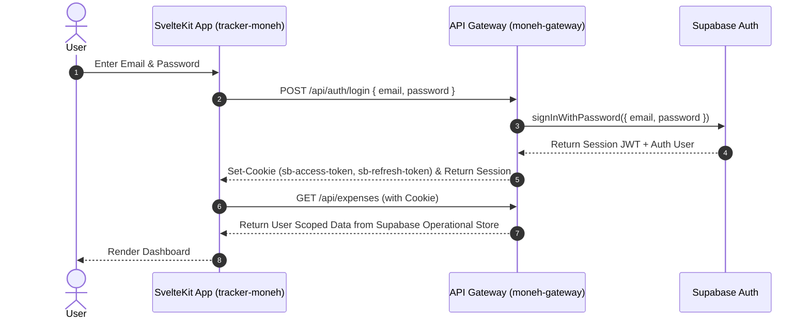
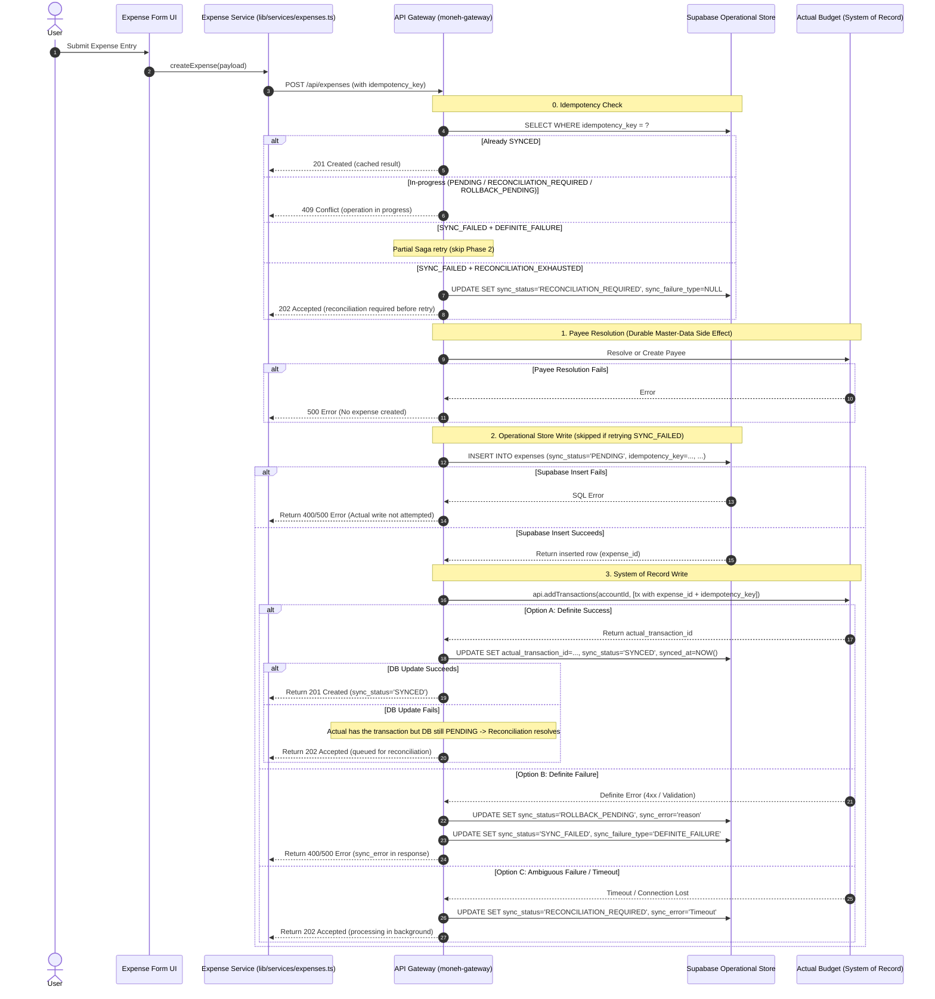
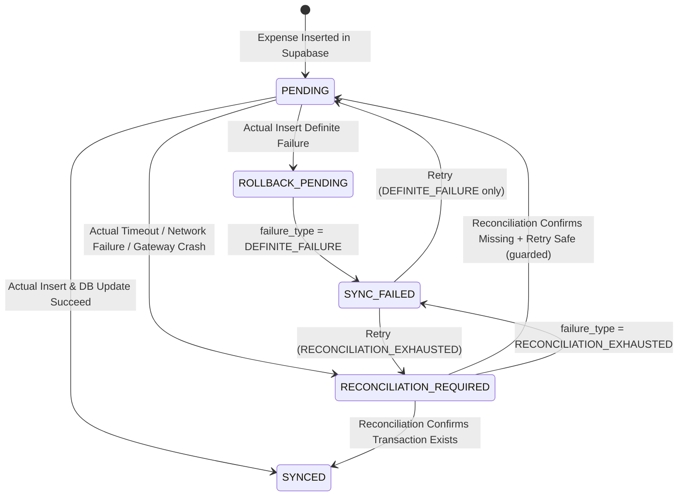

# Visual Architecture & Data Flows

**Version:** 2.3  
**Status:** Approved Architectural Spec — Ready for Implementation  
**Financial System of Record:** Actual Budget (`https://budget.novianlabs.my.id`)  
**Tracker Operational Store:** Supabase (PostgreSQL)  
**Detailed Integration Spec:** [moneh-gateway/docs/ACTUAL_BUDGET_INTEGRATION.md](../../moneh-gateway/docs/ACTUAL_BUDGET_INTEGRATION.md)

---

## 1. System Layer Architecture & Role Separation

```text
┌─────────────────────────────────────────────────────────┐
│                       UI Layer                          │
│   SvelteKit Components & Pages (shadcn-svelte + Tailwind)│
└───────────┬─────────────────────────────────────────────┘
            │ Reactivity & UI State
            ▼
┌─────────────────────────────────────────────────────────┐
│                    Data Query Layer                     │
│                     TanStack Query                      │
└───────────┬─────────────────────────────────────────────┘
            │ Centralized Service Calls (src/lib/services/)
            ▼
┌─────────────────────────────────────────────────────────┐
│                     API Gateway                         │
│                    (moneh-gateway)                      │
│        - Auth Guard & Session Validation                │
│        - Saga Dual-Write Orchestrator                   │
│        - Idempotency & Reconciliation Engine            │
└───────────┬─────────────────────────────────┬───────────┘
            │ SQL Queries                     │ Headless SDK API
            ▼                                 ▼
┌─────────────────────────────────┐ ┌─────────────────────────┐
│        Supabase Backend         │ │      Actual Budget      │
│   (Operational Store & Cache)   │ │  (System of Record:     │
│   - Fast queries & analytics    │ │   Accounts, Payees,     │
│   - Integration metadata        │ │   Ledger Transactions)  │
│   - Sync status & audit trail   │ └─────────────────────────┘
└─────────────────────────────────┘
```

### Key Architectural Responsibilities
- **Actual Budget**: Financial System of Record for Accounts, Payees, Categories, and Ledger entries.
- **Supabase**: Operational Store & Read Model for fast UI rendering, custom Tracker filters, dashboard analytics, integration status tracking (`sync_status`, `sync_failure_type`, `sync_error`, `idempotency_key`), and failure audit history. Not every Tracker field needs to exist in Actual Budget.
- **moneh-gateway**: Saga Orchestrator executing transactional dual-writes with compensating actions, idempotent request handling, and background reconciliation.
- **Reconciliation**: Safety net for distributed failures (timeouts, crashes, network drops) occurring outside the synchronous HTTP request lifecycle.

### Core Retry Safety Rule

> **A definite Actual Budget failure may be directly retried. An unresolved/ambiguous Actual Budget failure must be reconciled before any new financial transaction is created.**

---

## 2. Correlation Identifiers

Every expense operation uses two distinct identifiers:

| Identifier | Purpose | Lifecycle |
| :--- | :--- | :--- |
| `expense_id` (Supabase PK) | **Business identity** of the expense record. Immutable. Primary correlation key linking Supabase and Actual Budget. | Created on Supabase INSERT. Persists for the record lifetime, including `SYNC_FAILED` records. |
| `idempotency_key` | **Client/request operation identity**. Prevents duplicate `POST /api/expenses` processing at the gateway. | Generated per unique user submission. `UNIQUE` constraint in Supabase. |

Both identifiers are embedded in Actual Budget transaction metadata for reconciliation correlation:

```text
[moneh_expense_id: <expense_id>]
[moneh_idempotency_key: <idempotency_key>]
```

> [!NOTE]
> The exact Actual Budget field used for embedding correlation identifiers (e.g. `notes`) is **implementation-dependent**. See the full integration spec for the [implementation dependency details](../../moneh-gateway/docs/ACTUAL_BUDGET_INTEGRATION.md).

---

## 3. Authentication Flow



---

## 4. Expense Creation & Saga-Based Dual-Write Flow



### Record Preservation & Retry Policy

Failed expense records are **never hard-deleted** as the default compensation strategy. On definite failure:

```text
sync_status:       PENDING → ROLLBACK_PENDING → SYNC_FAILED
sync_failure_type: NULL    → NULL              → DEFINITE_FAILURE
sync_error:        NULL    → '<reason>'        → '<reason>'
```

The record is preserved for failure observability, audit trail, and potential retry.

### Failure Classification & Retry Behavior

| `sync_failure_type` | Meaning | Retry Behavior |
| :--- | :--- | :--- |
| `DEFINITE_FAILURE` | Actual Budget definitively rejected the transaction. No transaction was created. | Safe to directly retry → `PENDING` → Partial Saga. |
| `RECONCILIATION_EXHAUSTED` | Gateway could not determine whether the transaction exists after exhausting reconciliation. | **Must reconcile first** → `RECONCILIATION_REQUIRED` → determine state → then retry if safe. |

See the [full retry specification](../../moneh-gateway/docs/ACTUAL_BUDGET_INTEGRATION.md) for detailed flows.

---

## 5. Sync State Machine



### Guarded Transition: `RECONCILIATION_REQUIRED → PENDING`

This transition is **only** permitted when reconciliation has confirmed:
1. No matching transaction exists in Actual Budget for this `expense_id` / `idempotency_key`.
2. The original operation is safe to retry (no partial or ambiguous state).
3. All correlation lookups returned negative.

If the state cannot be safely determined, the record **remains** in `RECONCILIATION_REQUIRED` until the next reconciliation cycle. It transitions to `SYNC_FAILED` with `sync_failure_type = 'RECONCILIATION_EXHAUSTED'` only after the retry policy is exhausted.

### Stale `ROLLBACK_PENDING` Recovery

If the gateway crashes between setting `ROLLBACK_PENDING` and `SYNC_FAILED`, reconciliation detects stale records (past the grace period) and advances them to `SYNC_FAILED` with `sync_failure_type = 'DEFINITE_FAILURE'`, since the Actual Budget failure was already confirmed as definite.

---

## 6. Failure Handling & Recovery Matrix

| Failure Scenario | `sync_status` | `sync_failure_type` | Actual Budget State | Recovery Action |
| :--- | :--- | :--- | :--- | :--- |
| **Payee creation fails** | No record | — | No payee / No transaction | Return error to UI. |
| **Supabase insert fails** | No record | — | Payee may exist (durable) | Return error to UI. Actual write not attempted. |
| **Actual definite failure** | `ROLLBACK_PENDING` → `SYNC_FAILED` | `DEFINITE_FAILURE` | No transaction | Record failure. Safe to retry. |
| **Actual timeout** | `RECONCILIATION_REQUIRED` | `NULL` | Unknown | Return 202. Reconciliation resolves. |
| **Actual succeeds, Supabase update fails** | `PENDING` (stale) | `NULL` | Transaction exists | Reconciliation → `SYNCED`. |
| **Gateway crashes after Actual succeeds** | `PENDING` / `RECONCILIATION_REQUIRED` | `NULL` | Transaction exists | Reconciliation → `SYNCED`. |
| **Gateway crashes between `ROLLBACK_PENDING` and `SYNC_FAILED`** | `ROLLBACK_PENDING` (stale) | `NULL` | No transaction | Reconciliation → `SYNC_FAILED` (`DEFINITE_FAILURE`). |
| **Reconciliation confirms transaction exists** | → `SYNCED` | `NULL` | Transaction exists | Link `actual_transaction_id`. |
| **Reconciliation confirms missing + retry safe** | → `PENDING` | `NULL` | No transaction | Safe retry on next cycle. |
| **Reconciliation cannot determine state** | Remains `RECONCILIATION_REQUIRED` | `NULL` | Unknown | Retry on next reconciliation cycle. |
| **Reconciliation exhausted** | → `SYNC_FAILED` | `RECONCILIATION_EXHAUSTED` | Unknown | Manual intervention. **NOT safe to directly retry.** |
| **Retry of `DEFINITE_FAILURE`** | → `PENDING` | `NULL` | No transaction | Partial Saga (Phase 1 + 3, skip Phase 2). |
| **Retry of `RECONCILIATION_EXHAUSTED`** | → `RECONCILIATION_REQUIRED` | `NULL` | Unknown | Reconciliation first, then retry if safe. |
