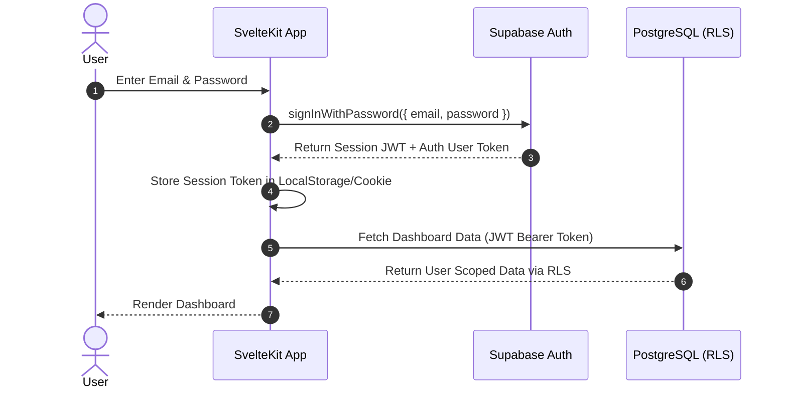
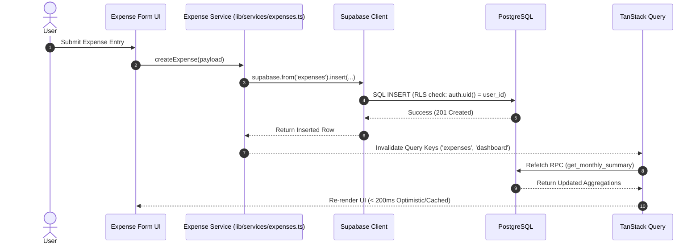
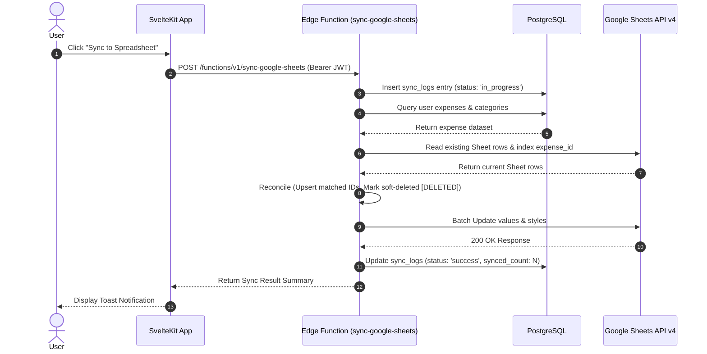

# Visual Architecture & Data Flows

**Version:** 0.1  
**Status:** Approved Specification  
**Base Specs:** [TECHNICAL-SPECIFICATION.md](TECHNICAL-SPECIFICATION.md), [DATABASE.md](DATABASE.md), [DECISIONS.md](DECISIONS.md)

---

## 1. System Layer Architecture

```text
┌─────────────────────────────────────────────────────────┐
│                       UI Layer                          │
│   SvelteKit Components & Pages (shadcn-svelte + Tailwind)│
└───────────┬─────────────────────────────────────────────┘
            │ Reactivity & UI State
            ▼
┌─────────────────────────────────────────────────────────┐
│                    Data Query Layer                     │
│                     TanStack Query                      │
└───────────┬─────────────────────────────────────────────┘
            │ Centralized Service Wrapper Invocation
            ▼
┌─────────────────────────────────────────────────────────┐
│                     Service Layer                       │
│     (src/lib/services/expenses.ts, categories.ts, auth) │
└───────────┬─────────────────────────────────┬───────────┘
            │ supabase-js (JWT Header)        │ Edge Function POST
            ▼                                 ▼
┌─────────────────────────────────────────────────────────┐
│                    Supabase Backend                     │
│  - PostgreSQL (bigint Amount, Views, RPCs, RLS)        │
│  - Edge Function: sync-google-sheets                    │
└─────────────────────────────────────────────┬───────────┘
                                              │ Google Sheets API v4
                                              ▼
                                ┌─────────────────────────┐
                                │   Google Spreadsheet    │
                                └─────────────────────────┘
```

---

## 2. Authentication Flow



---

## 3. Expense Creation Flow



---

## 4. Google Spreadsheet Synchronization Flow


