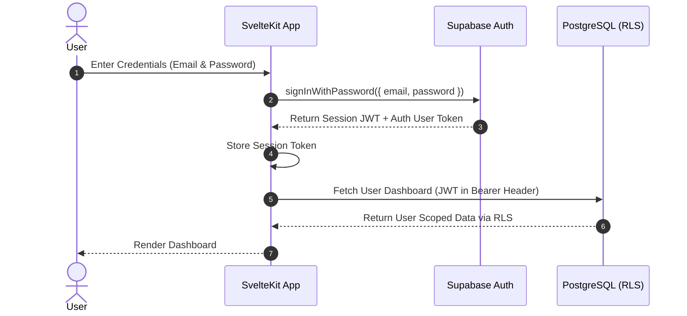
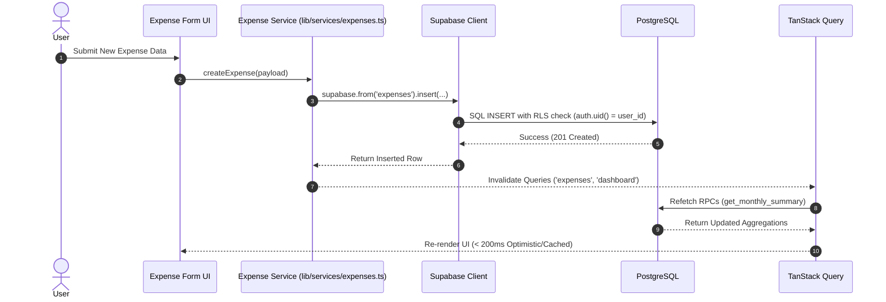
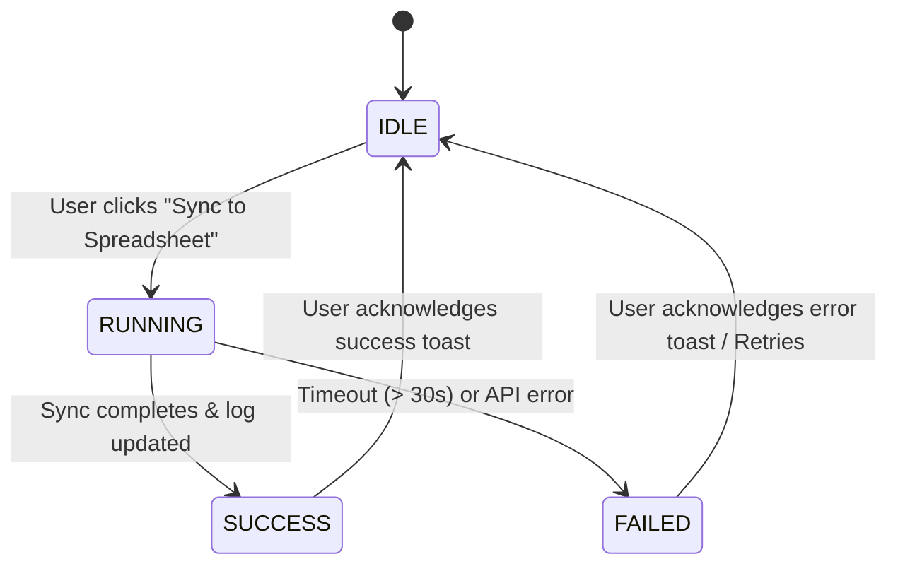

# Technical Specification: Personal Expense Tracker

**Version:** 0.4  
**Status:** Approved Architectural Spec  
**Base PRD:** [PRD-Personal-Expense-Tracker.md](file:///D:/Code/projects/tracker-moneh/docs/PRD-Personal-Expense-Tracker.md)  
**Architecture Decisions:** [DECISIONS.md](file:///D:/Code/projects/tracker-moneh/docs/DECISIONS.md)

---

## 1. System Architecture & Service Layer

### 1.1 High Level Layering

```text
┌─────────────────────────────────────────────────────────┐
│                       UI Layer                          │
│        SvelteKit Components & Pages (shadcn-svelte)     │
└───────────┬─────────────────────────────────────────────┘
            │ Reactivity & State Management
            ▼
┌─────────────────────────────────────────────────────────┐
│                    Data Query Layer                     │
│                     TanStack Query                      │
└───────────┬─────────────────────────────────────────────┘
            │ Centralized Service Calls
            ▼
┌─────────────────────────────────────────────────────────┐
│                     Service Layer                       │
│        (src/lib/services/expenses.ts, auth.ts, sync.ts) │
└───────────┬─────────────────────────────────┬───────────┘
            │ supabase-js API                 │ Edge Function POST
            ▼                                 ▼
┌─────────────────────────────────────────────────────────┐
│                    Supabase Backend                     │
│  - PostgreSQL (Bigint Amount, Views, RPCs, RLS)        │
│  - Edge Function: sync-google-sheets                    │
└─────────────────────────────────────────────┬───────────┘
                                              │ Google Sheets API v4
                                              ▼
                                ┌─────────────────────────┐
                                │   Google Spreadsheet    │
                                └─────────────────────────┘
```

> **Service Layer Rule:** UI components MUST NOT issue direct raw Supabase API queries. All database interactions, RPC calls, and Edge Function calls must be encapsulated within `src/lib/services/`.

---

## 2. Navigation Flow & Application Hierarchy

```text
                  ┌───────────────┐
                  │  Login Page   │
                  └───────┬───────┘
                          │ Authenticated
                          ▼
                  ┌───────────────┐
                  │   Dashboard   │
                  └───────┬───────┘
        ┌─────────────────┼─────────────────┐
        │                 │                 │
        ▼                 ▼                 ▼
┌───────────────┐ ┌───────────────┐ ┌───────────────┐
│ Expenses List │ │  Categories   │ │ Sync / Settings│
└───────────────┘ └───────────────┘ └───────────────┘
```

---

## 3. Sequence Diagrams

### 3.1 Authentication Flow



### 3.2 Create Expense Flow



---

## 4. Synchronization State Machine & Lifecycle

### 4.1 Sync State Diagram



- **IDLE:** Sync trigger button active and ready.
- **RUNNING:** Edge function executing reconciliation; `sync_logs` status set to `in_progress`.
- **SUCCESS:** Reconciliation complete; `sync_logs` updated to `success`; UI displays success toast.
- **FAILED:** Exception thrown; `sync_logs` updated with `error_message`; UI displays error notification.

### 4.2 Handling Deleted Records (Soft-Delete Mark)
- **Strategy:** **`[DELETED]` Tag & Strikethrough.**
- When an expense deleted in PostgreSQL is reconciled, the Edge Function updates its row status in Google Spreadsheet to `[DELETED]` and applies strikethrough styling.
- **Rationale:** Preserves manual monthly review audit trails while clearly marking removed items.

### 4.3 Idempotency & Upsert
- Reconciles rows using `expense_id` lookup. Multiple runs result in identical spreadsheet state without duplicate entries.

---

## 5. Error Catalog

| Code | Error Description | Responsible Layer | Action / Recovery |
| :--- | :--- | :--- | :--- |
| `AUTH001` | Invalid email or password | Supabase Auth | Prompt user to re-enter credentials |
| `AUTH002` | Session expired / Unauthorized | SvelteKit Guard | Redirect user to Login page |
| `EXP001` | Category not found or invalid FK | PostgreSQL RLS / DB | Select a valid active category |
| `EXP002` | Expense validation failed (amount <= 0) | Frontend Service | Highlight invalid amount field |
| `SYNC001` | Google Sheets API unavailable | Edge Function | Retry exponential backoff (max 3x) |
| `SYNC002` | Spreadsheet permission / Auth failure | Edge Function | Verify Service Account IAM permissions |
| `SYNC003` | Edge Function execution timeout (> 30s)| Edge Function | Log error to `sync_logs`, alert user |
| `DB001` | Database connection or RLS failure | PostgreSQL | Inspect RLS policy & network connectivity |

---

## 6. Environment Configuration & Feature Flags

| Variable | Type | Default | Purpose |
| :--- | :--- | :--- | :--- |
| `PUBLIC_SUPABASE_URL` | string | - | Supabase project URL |
| `PUBLIC_SUPABASE_ANON_KEY` | string | - | Public client API key |
| `ENABLE_SYNC` | boolean | `true` | UI feature toggle for Google Sheets sync |
| `ENABLE_DEBUG` | boolean | `false` | Enables verbose debug logging |

> **Seed Management Note:** Seed data management is strictly handled via Supabase CLI (`supabase/seed.sql` for local development). Frontend code contains no seed execution logic or feature flags.

---

## 7. Database RPC Functions & Views Integration

- **Views:** `recent_expenses` (Static joined view for transaction feeds).
- **RPC Functions:** 
  - `get_monthly_summary(p_month)`
  - `get_monthly_category_breakdown(p_month)`
  - `get_recent_transactions(p_limit)`

*(Full DDL and parameters documented in [DATABASE.md](file:///D:/Code/projects/tracker-moneh/docs/DATABASE.md))*

---

## 8. Non-Functional Requirements & Performance Targets

- **Expense Add Latency:** UI response < 200ms using optimistic update.
- **Dashboard Load Time:** Queries < 500ms using pre-calculated RPCs.
- **Spreadsheet Sync Timeout:** Execution limit < 30 seconds.
